# CTF Pilot's CTFd Manager

CTF Pilot's CTFd Manager is a management API and orchestration tool for [CTFd](https://ctfd.io).

The tool contains a management API that allows for programmatic management of CTFd content, and a Kubernetes listener, that allows for continued deployment of CTFd content.

The tool listens for new content added as ConfigMaps in a designated Kubernetes namespace, and automatically uploads them to the connected CTFd instance. When ConfigMaps are updated, the changes are automatically reflected in CTFd. When the ConfigMaps are deleted, the content will be hidden from CTFd, instead of being permanently deleted, allowing for recovery if needed.

> [!NOTE]
> Currently, initial setup of CTFd, and continued deployment of challenges and pages is supported.

> [!CAUTION]
> The tool has full admin access to the connected CTFd instance, and can modify all content.  
> Ensure to run the tool in a secure environment, and protect access to the management API.
>
> The tool is made to be non-destructive, but retain the needed permissions to change all content.

## Table of Contents

- [Supported Versions](#supported-versions)
- [How to run](#how-to-run)
- [API Reference](#api-reference)
- [Operation guide](#operation-guide)
- [Troubleshooting](#troubleshooting)
- [Security Considerations](#security-considerations)
- [Architecture](#architecture)
- [Contributing](#contributing)
- [License](#license)
- [Code of Conduct](#code-of-conduct)

## Supported Versions

This CTFd Manager is tested and compatible with:

- **CTFd**: 3.7.7 and later
- **Kubernetes**: 1.32+
- **Go**: 1.21+ (for development)

While the manager may work with earlier and later versions, they are not officially supported or tested.

## How to run

The following sections describes how to run the CTFd manager application.

### Notes

The application makes use of restarting to try to fix errors.  
Ensure to run the application with health checks and restart when appropriate automatically.

### Prerequisites

The application is built to run *inside* a Kubernetes cluster.  
This is due to how it retrieves the Kubernetes connection configuration.

#### Service account

The application requires the following access through Kubernetes RBAC service account:

- Api groups: `""`, resources: `configmaps`, verbs: `get`, `list`, `watch`, `update`, `patch`

#### ConfigMaps

In order for the application to run properly, the following ConfigMaps must be created in the same namespace as the application is running in, before the application is started:

- `ctfd-access-token`: Will contain the CTFd API access token for the manager. The manager will automatically store the API access token in `access_token` when setting up CTFd for the first time.
- `ctfd-challenges`: Will store the uploaded challenges to CTFd. The manager will automatically create and update this ConfigMap when challenges are uploaded the service.
- `ctfd-pages`: Will store the uploaded pages to CTFd. The manager will automatically create and update this ConfigMap when pages are uploaded through the service.
- `challenge-configmap-hashset`: Will store a hashset of uploaded challenges and pages, in order to track changes. The manager will automatically create and update this ConfigMap when challenges or pages are uploaded through the service.
- `mapping-map`: Should store a mapping of category and difficulty slugs to category names. Will be used to dynamically change the "category" field in challenges. See the [Category and Difficulty Mapping](#category-and-difficulty-mapping) section for more information.

> [!NOTE]
> **Namespace Requirement:**  
> All challenge and page ConfigMaps, as well as required configuration, **must be located in the namespace specified by the `NAMESPACE` environment variable** for the manager. The manager can run in a different namespace, but will only watch and manage resources in the namespace defined by `NAMESPACE`. Ensure your service account and RBAC permissions allow access to this namespace.

### Running the application

> [!TIP]
> Included in the repository is a sample Kubernetes deployment manifest, `k8s/example.yml`, which can be used to deploy the application to a Kubernetes cluster.

> [!IMPORTANT]
> Currently, the application has not been built to run with multiple replicas.  
> Ensure to only run a single replica of the application to avoid race conditions and conflicts.

The repository automatically builds a Docker image for the application and pushes it to GitHub Container Registry: `ghcr.io/ctfpilot/ctfd-manager:latest`.  
The image is versioned, so you can also use specific versions, for example: `ghcr.io/ctfpilot/ctfd-manager:1.0.0`.  
For more information, see the [Docker image package](https://github.com/ctfpilot/ctfd-manager/pkgs/container/ctfd-manager)

#### Configuration

> [!WARNING]
> Before configuring, please ensure permissions are created correctly through the service account, and the required ConfigMaps are created. See the [Prerequisites](#prerequisites) section for more information.  
> Failure to setup these elements correctly may lead to the application failing to start or work correctly.

The application needs the following configuration through environment variables:

- `CTFD_URL`: The URL to the CTFd instance to manage.  
  *Example: `https://ctfd.example.com`*
- `PASSWORD`: The password to use for API authorization, provided by the service.  
  **This should be a strong password, as it will give admin access to the CTFd instance and all challenge information.**
  *Example: `SuperSecretPassword123!`*
- `NAMESPACE`: The Kubernetes namespace the application is running in.  
  *Example: `ctfd-manager`*
- `GITHUB_REPO`: The GitHub repository to use for challenge files.  
  *Example: `ctfpilot/ctfd-challenges`*
- `GITHUB_BRANCH`: The GitHub branch to use for challenge files.  
  *Example: `main` or `develop`*
- `GITHUB_TOKEN`: The GitHub access token to use for accessing the challenge files repository.  
  *Example: `ghp_XXXXXXXXXXXXXXXXXXXX`*

> [!IMPORTANT]
> Passwords should always be stored using secrets instead of cleartext environment variables.

#### Development

To develop, build the docker image locally:

```bash
docker build -t ctfd-manager:dev .
```

Then deploy the application within Kubernetes, using the local image.

To update the Kubernetes deployment file, update the deployment template in `template/k8s.yml`.  
An updated `k8s/k8s.yml` will then be automatically generated on the next release.

## API Reference

The CTFd Manager exposes a REST API for programmatic management of challenges and CTFd content.

### Authentication

All API endpoints (except health checks) require Bearer token authentication using the password configured via the `PASSWORD` environment variable.

Include the authorization header in your requests:

```bash
Authorization: Bearer <your-password>
```

Example curl command:

```bash
curl -H "Authorization: Bearer <password>" \
  http://localhost:8080/api/challenges
```

### Endpoints

#### Challenge Management

- **GET `/api/challenges`**: List all available challenges from Kubernetes ConfigMaps.
  Response format:
  
  ```json
  {
    "challenges": [
      {"name": "web-challenge-1"},
      {"name": "crypto-challenge-1"}
    ]
  }
  ```

- **GET `/api/challenges/{id}`**: Get detailed configuration for a specific challenge.
- **GET `/api/challenges/{id}/files`**: List files available for a challenge from the GitHub repository.
- **GET `/api/challenges/{id}/files/{file}`**: Download a specific file for a challenge.

#### CTFd Operations

- **POST `/api/ctfd/setup`**: Initialize CTFd instance with initial configuration. This should be run once when first setting up CTFd.
  
  ```bash
  curl -X POST -H "Authorization: Bearer <password>" \
    -H "Content-Type: application/json" \
    -d @setup-params.json \
    http://localhost:8080/api/ctfd/setup
  ```

  <details>
  <summary><strong>Setup Parameters</strong> (click to expand)</summary>

  The setup endpoint accepts a JSON body with the following parameters:

  ##### Required Parameters

  | Parameter                 | Type    | Description                                                              | Example                              |
  | ------------------------- | ------- | ------------------------------------------------------------------------ | ------------------------------------ |
  | `ctf_name`                | string  | Name of the CTF event                                                    | `"My CTF 2025"`                      |
  | `ctf_description`         | string  | Description of the CTF                                                   | `"Annual cybersecurity competition"` |
  | `user_mode`               | string  | Participation mode: `"users"` or `"teams"`                               | `"teams"`                            |
  | `challenge_visibility`    | string  | Who can view challenges: `"public"`, `"private"`, or `"admins"`          | `"public"`                           |
  | `account_visibility`      | string  | Who can view accounts: `"public"`, `"private"`, or `"admins"`            | `"public"`                           |
  | `score_visibility`        | string  | Who can view scores: `"public"`, `"private"`, `"hidden"`, or `"admins"`  | `"public"`                           |
  | `registration_visibility` | string  | Who can register: `"public"`, `"private"`, or `"mlc"` (MajorLeagueCyber) | `"public"`                           |
  | `verify_emails`           | boolean | Whether to require email verification                                    | `false`                              |
  | `ctf_theme`               | string  | Theme name to use                                                        | `"core"`                             |
  | `name`                    | string  | Admin user's name                                                        | `"Admin User"`                       |
  | `email`                   | string  | Admin user's email                                                       | `"admin@example.com"`                |
  | `password`                | string  | Admin user's password                                                    | `"SecurePassword123!"`               |

  ##### Optional Time Parameters

  | Parameter | Type   | Description                     | Example        |
  | --------- | ------ | ------------------------------- | -------------- |
  | `start`   | string | CTF start time (Unix timestamp) | `"1700000000"` |
  | `end`     | string | CTF end time (Unix timestamp)   | `"1700086400"` |

  ##### Optional Team Parameters

  | Parameter   | Type    | Description                                              | Example |
  | ----------- | ------- | -------------------------------------------------------- | ------- |
  | `team_size` | integer | Maximum team size (required if `user_mode` is `"teams"`) | `4`     |

  ##### Optional Bracket Parameters

  | Parameter  | Type  | Description                         |
  | ---------- | ----- | ----------------------------------- |
  | `brackets` | array | List of bracket objects (see below) |

  **Bracket Object Structure:**

  ```json
  {
    "name": "College Students",
    "description": "For college and university students",
    "type": "teams"
  }
  ```

  - `name` (string, required): Bracket name
  - `description` (string, optional): Bracket description (max 255 chars)
  - `type` (string, optional): Bracket type - empty string, `"users"`, or `"teams"`

  ##### Optional Theme Parameters

  | Parameter       | Type   | Description            | Example                                         |
  | --------------- | ------ | ---------------------- | ----------------------------------------------- |
  | `ctf_logo`      | object | CTF logo file          | `{"name": "logo.png", "content": "<base64>"}`   |
  | `ctf_banner`    | object | CTF banner image       | `{"name": "banner.jpg", "content": "<base64>"}` |
  | `ctf_smallicon` | object | CTF small icon/favicon | `{"name": "icon.png", "content": "<base64>"}`   |
  | `theme_color`   | string | Theme color (hex code) | `"#3b7dd6"`                                     |

  **File Object Structure:**

  ```json
  {
    "name": "logo.png",
    "content": "iVBORw0KGgoAAAANSUhEUgAAAAUA..."
  }
  ```

  - `name` (string): Filename with extension
  - `content` (string): Base64-encoded file content

  ##### Optional Mail Server Parameters

  | Parameter       | Type    | Description                | Example                 |
  | --------------- | ------- | -------------------------- | ----------------------- |
  | `mail_server`   | string  | SMTP server address        | `"smtp.gmail.com"`      |
  | `mail_port`     | integer | SMTP server port (1-65535) | `587`                   |
  | `mail_username` | string  | SMTP username              | `"noreply@example.com"` |
  | `mail_password` | string  | SMTP password              | `"smtp-password"`       |
  | `mail_ssl`      | boolean | Use SSL for SMTP           | `false`                 |
  | `mail_tls`      | boolean | Use TLS for SMTP           | `true`                  |
  | `mail_from`     | string  | Sender email address       | `"noreply@example.com"` |

  ##### Optional Registration Parameters

  | Parameter           | Type   | Description                    | Example        |
  | ------------------- | ------ | ------------------------------ | -------------- |
  | `registration_code` | string | Code required for registration | `"SECRET2025"` |

  ##### Example Complete Setup Request

  ```json
  {
    "ctf_name": "My CTF 2025",
    "ctf_description": "Annual cybersecurity competition",
    "start": "1700000000",
    "end": "1700086400",
    "user_mode": "teams",
    "challenge_visibility": "public",
    "account_visibility": "public",
    "score_visibility": "public",
    "registration_visibility": "public",
    "verify_emails": false,
    "team_size": 4,
    "brackets": [
      {
        "name": "College Students",
        "description": "For college and university students",
        "type": "teams"
      },
      {
        "name": "Professionals",
        "description": "For security professionals",
        "type": "teams"
      }
    ],
    "ctf_theme": "core",
    "theme_color": "#3b7dd6",
    "name": "Admin User",
    "email": "admin@example.com",
    "password": "SecurePassword123!",
    "mail_server": "smtp.gmail.com",
    "mail_port": 587,
    "mail_username": "noreply@example.com",
    "mail_password": "smtp-password",
    "mail_ssl": false,
    "mail_tls": true,
    "mail_from": "noreply@example.com",
    "registration_code": "SECRET2025"
  }
  ```

  ##### Example Minimal Setup Request

  ```json
  {
    "ctf_name": "Quick CTF",
    "ctf_description": "A simple CTF event",
    "user_mode": "users",
    "challenge_visibility": "public",
    "account_visibility": "public",
    "score_visibility": "public",
    "registration_visibility": "public",
    "verify_emails": false,
    "ctf_theme": "core",
    "name": "Admin",
    "email": "admin@ctf.local",
    "password": "ChangeMe123!"
  }
  ```

  </details>

- **POST `/api/ctfd/challenges/init`**: Upload all challenges to CTFd. Creates new challenges or updates existing ones.
- **GET `/api/ctfd/challenges`**: List all challenges currently in CTFd.
- **GET `/api/ctfd/challenges/uploaded`**: List challenges that have been uploaded by the manager with their CTFd IDs.

#### System Endpoints

- **GET `/api/version`**: Get the version information of the manager.
- **GET `/api/status`** or **GET `/status`**: Health check endpoint. Returns `200 OK` with `{"status":"ok"}` when healthy, or `500` with `{"status":"error"}` when unhealthy.

## Operation guide

The following sections describes how to operate the CTFd manager.

### Initial Setup Guide

Follow these steps for first-time deployment:

#### 1. Create Required ConfigMaps

Before starting the manager, create the required ConfigMaps in your namespace:

```bash
# Create namespace
kubectl create namespace ctfd-manager

# Create empty ConfigMaps
kubectl create configmap ctfd-access-token -n ctfd-manager
kubectl create configmap ctfd-challenges -n ctfd-manager
kubectl create configmap ctfd-pages -n ctfd-manager
kubectl create configmap challenge-configmap-hashset -n ctfd-manager

# Create mapping ConfigMap with category/difficulty mappings
kubectl create configmap mapping-map -n ctfd-manager \
  --from-literal=categories="{\"web\":\"Web Challenges\",\"crypto\":\"Cryptography\",\"pwn\":\"Binary Exploitation\"}" \
  --from-literal=difficulties="{\"easy\":\"Easy\",\"medium\":\"Medium\",\"hard\":\"Hard\"}" \
  --from-literal=difficulty-categories="{\"beginner\":\"Beginner Challenges\"}"
```

#### 2. Create Service Account and RBAC

Apply the RBAC configuration from the example manifest:

```bash
kubectl apply -f k8s/example.yml
```

Or create manually:

```bash
# Create service account
kubectl create serviceaccount ctfd-manager -n ctfd-manager

# Create role with ConfigMap permissions
kubectl create role ctfd-manager -n ctfd-manager \
  --verb=get,list,watch,update,patch \
  --resource=configmaps

# Create role binding
kubectl create rolebinding ctfd-manager -n ctfd-manager \
  --role=ctfd-manager \
  --serviceaccount=ctfd-manager:ctfd-manager
```

#### 3. Create Secrets

Store sensitive information in Kubernetes secrets:

```bash
# Encode your values
echo -n "your-github-token" | base64
echo -n "your-strong-password" | base64

# Create secret
kubectl create secret generic ctfd-manager-secret -n ctfd-manager \
  --from-literal=github-token=your-github-token \
  --from-literal=password=your-strong-password
```

#### 4. Deploy the Manager

Update the example manifest with your configuration and apply:

```bash
kubectl apply -f k8s/example.yml
```

#### 5. Initialize CTFd

Once the manager is running, initialize your CTFd instance:

```bash
# Get the manager service endpoint
kubectl get svc ctfd-manager -n ctfd-manager

# Setup CTFd (run once)
curl -X POST -H "Authorization: Bearer <your-password>" \
  -H "Content-Type: application/json" -d @setup-params.json \
  http://<manager-endpoint>:8080/api/ctfd/setup

# Upload challenges (run once)
curl -X POST -H "Authorization: Bearer <your-password>" \
  http://<manager-endpoint>:8080/api/ctfd/challenges/init
```

Challenges added to Kubernetes, will now be automatically synchronized to CTFd.

### Challenge and Page ConfigMap Format

CTFd Manager loads challenge and page definitions from Kubernetes ConfigMaps. These must follow strict formats based on the CTF Pilot schemas:

- **Challenges:** [CTF Pilot's Challenge Schema](https://github.com/ctfpilot/challenge-schema) (JSON)
- **Pages:** [CTF Pilot's Page Schema](https://github.com/ctfpilot/page-schema) (JSON)

CTFd Manager is not concerned with how the ConfigMaps are managed in Kubernetes, as long as they follow the required format.  
The CTFd manager will automatically pick up changes to the ConfigMaps and update CTFd accordingly.

> [!NOTE]
> Challenge and page ConfigMaps must be located in the `NAMESPACE` that is configured for the service.

#### Required ConfigMap Labels

| Type      | Label Key                          | Label Value        |
| --------- | ---------------------------------- | ------------------ |
| Challenge | `challenges.kube-ctf.io/configmap` | `challenge-config` |
| Page      | `challenges.kube-ctf.io/configmap` | `page-config`      |

**These labels are required for the manager to recognize and process the ConfigMap.**

#### Challenge ConfigMap Data Fields

| Field          | Required | Description                                     |
| -------------- | -------- | ----------------------------------------------- |
| `name`         | Yes      | Unique name for the challenge                   |
| `path`         | Yes      | Path to challenge files in the repository       |
| `repository`   | Yes      | GitHub repository for challenge files           |
| `challenge`    | Yes      | JSON object matching the Challenge Schema       |
| `description`  | Yes      | Short description of the challenge              |
| `generated_at` | Yes      | ISO8601 timestamp when the config was generated |

#### Page ConfigMap Data Fields

| Field          | Required | Description                                     |
| -------------- | -------- | ----------------------------------------------- |
| `slug`         | Yes      | Unique slug for the page                        |
| `name`         | Yes      | Name of the page                                |
| `path`         | Yes      | Path to page files in the repository            |
| `repository`   | Yes      | GitHub repository for page files                |
| `page`         | Yes      | JSON object matching the Page Schema            |
| `description`  | Yes      | Short description of the page                   |
| `generated_at` | Yes      | ISO8601 timestamp when the config was generated |

#### Example Challenge ConfigMap

```yaml
apiVersion: v1
kind: ConfigMap
metadata:
  name: web-challenge-1
  namespace: ctfd-manager
  labels:
    challenges.kube-ctf.io/configmap: challenge-config

data:
  name: "web-challenge-1"
  path: "web/web-challenge-1"
  repository: "ctfpilot/ctfd-challenges"
  challenge: |
    { ...Challenge Schema JSON... }
  description: "This is a web challenge focused on XSS vulnerabilities."
  generated_at: "2025-11-19T12:00:00Z"
```

#### Example Page ConfigMap

```yaml
apiVersion: v1
kind: ConfigMap
metadata:
  name: rules-page
  namespace: ctfd-manager
  labels:
    challenges.kube-ctf.io/configmap: page-config

data:
  slug: "rules"
  name: "Rules Page"
  path: "pages/rules"
  repository: "ctfpilot/ctfd-pages"
  page: |
    { ...Page Schema JSON... }
  description: "Competition rules and guidelines."
  generated_at: "2025-11-19T12:00:00Z"
```

### Category and Difficulty Mapping

In order to get proper categories and difficulties in CTFd, categories and difficulties can be mapped to specific names through the `mapping-map` ConfigMap.

Three mappings are available:

- `categories`: A mapping of category slugs to category names.  
  *Example: `web: Web Challenges`*
- `difficulties`: A mapping of difficulty slugs to difficulty names.  
  *Example: `easy: Easy Challenges`*
- `difficulty-categories`: A mapping of difficulty slugs to category names.  
  Allows for mapping a difficulty to a specific category, such as `beginner` difficulty challenges to a "Beginner Challenges" category.
  *Example: `easy: Easy Challenges`*

For category names, the service will first check the `difficulty-categories` mapping, then the `categories` mapping.  
If no mapping is found, the original category name from the challenge file will be used.  
If no category is found (empty string for challenge category), the challenge will be placed in the "Uncategorized" category in CTFd.

Currently, the difficulty is not uploaded to CTFd, as CTFd does not have a built-in difficulty field for challenges.

Example `mapping-map` ConfigMap:

```yaml
apiVersion: v1
kind: ConfigMap
metadata:
  name: mapping-map
  namespace: ctfd-manager
data:
  categories: | 
    {
      "web"        : "Web",
      "forensics"  : "Forensics",
      "rev"        : "Reverse Engineering",
      "crypto"     : "Crypto",
      "pwn"        : "Pwn",
      "boot2root"  : "Boot2Root",
      "osint"      : "OSINT",
      "misc"       : "Misc",
      "blockchain" : "Blockchain",
      "mobile"     : "Mobile"
    }
  difficulties: |
    {
      "beginner"    : "Beginner",
      "easy"        : "Easy",
      "easy-medium" : "Easy - Medium",
      "medium"      : "Medium",
      "medium-hard" : "Medium - Hard",
      "hard"        : "Hard",
      "very-hard"   : "Very Hard",
      "insane"      : "Insane"
    }
  difficulty-categories: |
    {
      "beginner" : "Beginner"
    }
```

### Attaching the manager to an existing CTFd

In order to attach the manager to an existing CTFd instance, you need to provide the manager with a valid CTFd API access token.  
This can be done by adding the access token to the `ctfd-access-token` ConfigMap in the same namespace as the manager is running in.

The token must be added under the key `access_token`.

For existing challenges and pages, these can be added to their appropriate ConfigMaps (`ctfd-challenges` and `ctfd-pages`) in order for the manager to manage them.  
They are added in the format of: `<challenge-or-page-slug>: <ctfd-id>`.

### Health checks

In order to ensure the application is running correctly, it exposes two health check endpoints, which provides the same information: `status` and `/api/status`.  
They will return 200 OK when the application is running correctly, and 500 Internal Server Error when there is an issue.  
The return body will contain a JSON object with a `status` field, which will be either `ok` or `error`.

Please set up Kubernetes to listen on these endpoints for liveness and readiness probes.

Example probe configuration:

```yaml
livenessProbe:
  httpGet:
    path: /status
    port: 8080
  initialDelaySeconds: 30
  periodSeconds: 10
readinessProbe:
  httpGet:
    path: /status
    port: 8080
  initialDelaySeconds: 5
  periodSeconds: 5
```

## Troubleshooting

Common issues and their solutions:

### Manager won't start

**Symptom**: Pod crashes or restarts repeatedly

**Possible causes**:

- Missing or incorrect ConfigMaps
- Insufficient RBAC permissions
- Invalid environment variables

**Solutions**:

1. Check pod logs: `kubectl logs -n <namespace> deployment/ctfd-manager`
2. Verify all required ConfigMaps exist: `kubectl get configmaps -n <namespace>`
3. Verify service account has correct permissions: `kubectl describe role ctfd-manager -n <namespace>`
4. Check environment variables are set correctly: `kubectl describe deployment ctfd-manager -n <namespace>`

### Health checks failing

**Symptom**: `/status` endpoint returns 500 error

**Possible causes**:

- Kubernetes API connection issues
- ConfigMap access problems
- Background watcher errors

**Solutions**:

1. Check manager logs for error messages
2. Verify RBAC permissions for ConfigMaps
3. Test ConfigMap access: `kubectl get configmap -n <namespace>`
4. Restart the deployment: `kubectl rollout restart deployment/ctfd-manager -n <namespace>`

### GitHub authentication errors

**Symptom**: Cannot fetch challenge files or repository contents

**Possible causes**:

- Invalid GitHub token
- Token lacks required permissions
- Repository or branch doesn't exist

**Solutions**:

1. Verify GitHub token has `Contents` read access (for fine-grained tokens) or `repo`/`public_repo` scope (for classic tokens)
2. Test token manually:

   ```bash
   curl -H "Authorization: token <github-token>" \
     https://api.github.com/repos/<owner>/<repo>/contents
   ```

3. Verify `GITHUB_REPO` and `GITHUB_BRANCH` environment variables are correct
4. Update secret with new token if needed:

   ```bash
   kubectl create secret generic ctfd-manager-secret -n <namespace> \
     --from-literal=github-token=new-token \
     --from-literal=password=your-password \
     --dry-run=client -o yaml | kubectl apply -f -
   ```

### CTFd API errors

**Symptom**: Cannot setup CTFd or upload challenges

**Possible causes**:

- CTFd instance not accessible
- Invalid CTFd API token
- CTFd already configured

**Solutions**:

1. Verify CTFd URL is accessible from the pod:

   ```bash
   kubectl exec -n <namespace> deployment/ctfd-manager -- curl <ctfd-url>
   ```

2. Check CTFd access token in ConfigMap:

   ```bash
   kubectl get configmap ctfd-access-token -n <namespace> -o yaml
   ```

3. For existing CTFd instances, manually add the API token to the ConfigMap:

   ```bash
   kubectl patch configmap ctfd-access-token -n <namespace> \
     --type merge -p '{"data":{"access_token":"your-ctfd-api-token"}}'
   ```

### Challenges not updating

**Symptom**: Changes in GitHub repository not reflected in CTFd

**Possible causes**:

- Change not triggered, due to challenge config not being updated in the Kubernetes
- Background watcher not running
- ConfigMap hashset not updating
- Challenge already exists with same ID

**Solutions**:

1. Check if challenge ConfigMap has been updated in Kubernetes
2. Check if background watcher is running (check logs for "background challenge watcher" messages)
3. Manually trigger upload:

   ```bash
   curl -X POST -H "Authorization: Bearer <password>" \
     http://<manager-endpoint>:8080/api/ctfd/challenges/init
   ```

4. Clear challenge hashset to force re-upload:

   ```bash
   kubectl delete configmap challenge-configmap-hashset -n <namespace>
   kubectl create configmap challenge-configmap-hashset -n <namespace>
   kubectl rollout restart deployment/ctfd-manager -n <namespace>
   ```

### Permission denied errors

**Symptom**: "Forbidden" or "403" errors in logs

**Possible causes**:

- Service account not attached to deployment
- RBAC role missing required permissions

**Solutions**:

1. Verify service account is configured:

   ```bash
   kubectl get deployment ctfd-manager -n <namespace> -o yaml | grep serviceAccountName
   ```

2. Add service account to deployment if missing:

   ```bash
   kubectl patch deployment ctfd-manager -n <namespace> \
     --type merge -p '{"spec":{"template":{"spec":{"serviceAccountName":"ctfd-manager"}}}}'
   ```

3. Verify role permissions include all required verbs:

   ```bash
   kubectl get role ctfd-manager -n <namespace> -o yaml
   ```

## Security Considerations

### Password Management

- Always store the API password in Kubernetes Secrets, never in plain environment variables
- Use strong passwords with high entropy (at least 32 characters recommended)
- Rotate passwords periodically

### GitHub Token Permissions

The GitHub token should have minimal required permissions:

- **Fine-grained tokens**: `Contents` read access for the specific repository
- **Classic tokens**: `repo` scope for private repositories, or `public_repo` scope for public repositories

Never use personal access tokens with admin privileges or unnecessary scopes.

## Architecture

The CTFd Manager orchestrates synchronization between Kubernetes, GitHub and the CTFd application. Below is an architecture diagram reflecting namespaces, required ConfigMaps, watched labels, and data flows.

```mermaid
graph TB
    subgraph k8s["Kubernetes Namespace (NAMESPACE)"]
        direction TB
        subgraph watched["Watched ConfigMaps"]
            cm["Challenge ConfigMaps<br/><small>label: challenge-config</small>"]
            pm["Page ConfigMaps<br/><small>label: page-config</small>"]
        end
        subgraph state["State ConfigMaps"]
            at["ctfd-access-token<br/><small>stores API token</small>"]
            hs["challenge-configmap-hashset<br/><small>tracks changes</small>"]
            cc["ctfd-challenges<br/><small>CTFd challenge IDs</small>"]
            cp["ctfd-pages<br/><small>CTFd page IDs</small>"]
        end
        mm["mapping-map<br/><small>category/difficulty mappings</small>"]
    end
    
    gh[("GitHub Repository<br/><small>GITHUB_REPO/GITHUB_BRANCH</small>")]
    mgr["CTFd Manager Pod<br/><small>API Server + Watcher</small>"]
    ctfd[("CTFd Instance<br/><small>CTFD_URL</small>")]
    api["API Clients<br/><small>Bearer auth with PASSWORD</small>"]
    
    cm -->|"watch events"| mgr
    pm -->|"watch events"| mgr
    mm -->|"read mappings"| mgr
    hs <-->|"read/write hashes"| mgr
    cc <-->|"read/write IDs"| mgr
    cp <-->|"read/write IDs"| mgr
    at <-->|"read/write token"| mgr
    
    mgr -->|"fetch challenge files<br/>(GITHUB_TOKEN)"| gh
    
    mgr -->|"create/update<br/>challenges & pages"| ctfd
    mgr -->|"initial setup<br/>(one-time)"| ctfd
    ctfd -.->|"return API token"| mgr
    
    api -->|"POST /api/ctfd/setup<br/>POST /api/ctfd/challenges/init<br/>GET /api/*"| mgr
    
    style k8s fill:#2d3748,stroke:#4299e1,stroke-width:2px
    style watched fill:#1a365d,stroke:#3182ce,stroke-width:1px,stroke-dasharray: 5 5
    style state fill:#1a202c,stroke:#718096,stroke-width:1px,stroke-dasharray: 5 5
    style mgr fill:#744210,stroke:#f6ad55,stroke-width:3px
    style gh fill:#553c9a,stroke:#9f7aea,stroke-width:2px
    style ctfd fill:#276749,stroke:#48bb78,stroke-width:2px
    style api fill:#742a2a,stroke:#fc8181,stroke-width:2px
    style cm fill:#1a202c,stroke:#a0aec0,stroke-width:1px
    style pm fill:#1a202c,stroke:#a0aec0,stroke-width:1px
    style mm fill:#1a202c,stroke:#a0aec0,stroke-width:1px
    style hs fill:#1a202c,stroke:#a0aec0,stroke-width:1px
    style cc fill:#1a202c,stroke:#a0aec0,stroke-width:1px
    style cp fill:#1a202c,stroke:#a0aec0,stroke-width:1px
    style at fill:#1a202c,stroke:#a0aec0,stroke-width:1px
```



Key points:

1. The manager watches only ConfigMaps in the namespace defined by the `NAMESPACE` environment variable.
2. Only large files (handouts) are pulled from GitHub; metadata & schema JSON come from ConfigMaps.
3. `challenge-configmap-hashset` prevents redundant uploads by tracking last applied hashes.
4. `mapping-map` dynamically rewrites category/difficulty presentation.
5. Access token is generated once at setup and persisted in `ctfd-access-token`.
6. Pages are created/updated or deleted based on presence/removal of page ConfigMaps.

**Components**:

1. **GitHub Repository**: Stores large challenge files (e.g., handouts) referenced by ConfigMaps.
2. **Kubernetes ConfigMaps**: Provide structured metadata & schema JSON for challenges/pages plus auxiliary state (mappings, hashes, token).
3. **CTFd Instance**: Receives created/updated challenges & pages via Manager API calls; issues access token during setup.
4. **CTFd Manager Pod**: Watches labeled ConfigMaps, fetches GitHub file content, applies mappings, manages lifecycle & synchronization.

**Data Flow**:

1. Watcher detects add/update/delete of labeled ConfigMaps (`challenge-config`, `page-config`).
2. Manager reads schema JSON + metadata from ConfigMap; pulls referenced files from GitHub repo/branch using configured token.
3. Applies category/difficulty mapping from `mapping-map` and determines effective category.
4. Creates or updates challenge/page in CTFd via authenticated REST calls (using stored access token).
5. Stores resulting CTFd IDs in `ctfd-challenges` / `ctfd-pages` ConfigMaps and updates hash in `challenge-configmap-hashset`.
6. On ConfigMap deletion: challenge is disabled (not hard-deleted) or page removed in CTFd; hash cleared.
7. Setup endpoint initializes platform, generates access token, writes it to `ctfd-access-token`.

## Contributing

We welcome contributions of all kinds, from **code** and **documentation** to **bug reports** and **feedback**!

Please check the [Contribution Guidelines (`CONTRIBUTING.md`)](/CONTRIBUTING.md) for detailed guidelines on how to contribute.

To maintain the ability to distribute contributions across all our licensing models, **all code contributions require signing a Contributor License Agreement (CLA)**.
You can review **[the CLA here](https://github.com/ctfpilot/cla)**. CLA signing happens automatically when you create your first pull request.  
To administrate the CLA signing process, we are using **[CLA assistant lite](https://github.com/marketplace/actions/cla-assistant-lite)**.

*A copy of the CLA document is also included in this repository as [`CLA.md`](CLA.md).*  
*Signatures are stored in the [`cla` repository](https://github.com/ctfpilot/cla).*

## License

This schema and repository is licensed under the **EUPL-1.2 License**.  
You can find the full license in the **[LICENSE](LICENSE)** file.

We encourage all modifications and contributions to be shared back with the community, for example through pull requests to this repository.  
We also encourage all derivative works to be publicly available under the **EUPL-1.2 License**.  
At all times must the license terms be followed.

For information regarding how to contribute, see the [contributing](#contributing) section above.

CTF Pilot is owned and maintained by **[The0Mikkel](https://github.com/The0mikkel)**.  
Required Notice: Copyright Mikkel Albrechtsen (<https://themikkel.dk>)

## Code of Conduct

We expect all contributors to adhere to our [Code of Conduct](/CODE_OF_CONDUCT.md) to ensure a welcoming and inclusive environment for all.
